# 1. Описание базы данных

В качестве системы управления базами данных используется СУБД PostgreSQL версии 14. Взаимодействие с базой данных реализовано посредством ORM-фреймворка Django ORM, обеспечивающего объектно-реляционное отображение моделей Python на таблицы базы данных.

Для реализации древовидной структуры категорий применяется библиотека django-mptt, использующая алгоритм Modified Preorder Tree Traversal (MPTT).

Схема базы данных представлена на рисунке 22.

```mermaid
%%{init: {'er': {'layoutDirection': 'TB'}}}%%
erDiagram
    direction TB

    django_content_type {
        int id PK
        varchar app_label
        varchar model
    }

    auth_permission {
        int id PK
        varchar name
        int content_type_id FK
        varchar codename
    }

    auth_group {
        int id PK
        varchar name
    }

    auth_group_permissions {
        int id PK
        int group_id FK
        int permission_id FK
    }

    users_user {
        int id PK
        varchar username
        varchar email
        varchar password
        varchar first_name
        varchar last_name
        boolean is_staff
        boolean is_superuser
        boolean is_active
        timestamp date_joined
        timestamp last_login
        bigint telegram_id
    }

    users_user_groups {
        int id PK
        int user_id FK
        int group_id FK
    }

    users_user_user_permissions {
        int id PK
        int user_id FK
        int permission_id FK
    }

    bot_botuser {
        int id PK
        bigint telegram_id
        varchar username
        varchar first_name
        varchar last_name
        varchar email
        boolean agreed_to_policy
        timestamp created_at
    }

    bot_botuser_subscribed_categories {
        int id PK
        int botuser_id FK
        int category_id FK
    }

    bot_botstatus {
        int id PK
        boolean is_running
        timestamp last_heartbeat
        timestamp last_alert_sent_at
        text error_message
        timestamp started_at
    }

    bot_adminnotificationsettings {
        int id PK
        int admin_user_id FK
        bigint telegram_id
        boolean notify_on_errors
        boolean notify_on_unauthorized
        boolean notify_on_bot_down
    }

    bot_supportrequest {
        int id PK
        int user_id FK
        int django_user_id FK
        text message
        timestamp created_at
        boolean is_resolved
    }

    content_equipment {
        int id PK
        varchar name
    }

    content_category {
        int id PK
        varchar title
        text description
        int parent_id FK
        int equipment_id FK
        boolean visible_in_bot
        boolean is_folder
        int order
        int lft
        int rght
        int tree_id
        int level
    }

    content_documentversion {
        int id PK
        varchar version
        varchar file
        varchar author
        timestamp created_at
        int content_node_id FK
        varchar telegram_file_id
    }

    analytics_auditlog {
        int id PK
        varchar action_type
        varchar object_type
        int object_id
        json details
        varchar ip_address
        timestamp timestamp
        int bot_user_id FK
        int user_id FK
    }

    analytics_searchquerylog {
        int id PK
        varchar query_text
        int results_count
        timestamp timestamp
        int user_id FK
        int django_user_id FK
    }

    analytics_botinteraction {
        int id PK
        varchar action_type
        varchar path
        int response_time_ms
        timestamp timestamp
        int user_id FK
        int django_user_id FK
    }

    %% Связи: admin log
    users_user ||--o{ django_admin_log : "user_id"
    django_content_type ||--o{ django_admin_log : "content_type_id"

    django_migrations {
        int id PK
        varchar app
        varchar name
        timestamp applied
    }

    django_admin_log {
        int id PK
        varchar object_repr
        varchar change_message
        varchar action_flag
        timestamp action_time
        int user_id FK
        int content_type_id FK
        varchar object_id
    }

    django_session {
        varchar session_key PK
        text session_data
        timestamp expire_date
    }

    %% Связи: auth
    django_content_type ||--o{ auth_permission : "content_type_id"
    auth_group ||--o{ auth_group_permissions : "group_id"
    auth_permission ||--o{ auth_group_permissions : "permission_id"

    %% Связи: users
    users_user ||--o{ users_user_groups : "user_id"
    auth_group ||--o{ users_user_groups : "group_id"
    users_user ||--o{ users_user_user_permissions : "user_id"
    auth_permission ||--o{ users_user_user_permissions : "permission_id"
    users_user ||--o| bot_adminnotificationsettings : "admin_user_id"

    %% Связи: контент
    content_category ||--o{ content_category : "parent_id (MPTT)"
    content_equipment ||--o{ content_category : "equipment_id"
    content_category ||--o{ content_documentversion : "content_node_id"
    content_category ||--o{ bot_botuser_subscribed_categories : "category_id"
    bot_botuser ||--o{ bot_botuser_subscribed_categories : "botuser_id"

    %% Связи: бот
    bot_botuser ||--o{ bot_supportrequest : "user_id"
    users_user ||--o{ bot_supportrequest : "django_user_id"

    %% Связи: аналитика
    users_user ||--o{ analytics_auditlog : "user_id"
    bot_botuser ||--o{ analytics_auditlog : "bot_user_id"
    users_user ||--o{ analytics_searchquerylog : "django_user_id"
    bot_botuser ||--o{ analytics_searchquerylog : "user_id"
    users_user ||--o{ analytics_botinteraction : "django_user_id"
    bot_botuser ||--o{ analytics_botinteraction : "user_id"
```

Рисунок 22 – Схема базы данных

База данных содержит двадцать одну таблицу, которые логически объединены в модули, представленные в таблице 18.

Таблица 18 – Модули базы данных

| Таблица | Назначение | Модуль |
| --- | --- | --- |
| users_user | Хранение данных внутренних пользователей | Управление пользователями |
| users_user_groups | Связь пользователей с группами прав | Управление пользователями |
| users_user_user_permissions | Индивидуальные разрешения пользователей | Управление пользователями |
| auth_group | Группы прав доступа | Управление пользователями |
| auth_group_permissions | Разрешения, назначенные группам | Управление пользователями |
| auth_permission | Справочник разрешений системы | Управление пользователями |
| django_content_type | Реестр типов объектов Django | Управление пользователями |
| bot_botuser | Пользователи Telegram-бота | Telegram-бот |
| bot_botuser_subscribed_categories | Подписки пользователей бота на категории | Telegram-бот |
| bot_botstatus | Состояние и работоспособность бота | Telegram-бот |
| bot_adminnotificationsettings | Настройки уведомлений администраторов | Telegram-бот |
| bot_supportrequest | Обращения пользователей в поддержку | Telegram-бот |
| content_equipment | Справочник оборудования | Управление контентом |
| content_category | Иерархия категорий документов (MPTT) | Управление контентом |
| content_documentversion | Версии документов и файлов | Управление контентом |
| analytics_auditlog | Журнал действий пользователей | Аналитика |
| analytics_searchquerylog | История поисковых запросов | Аналитика |
| analytics_botinteraction | Статистика взаимодействий с ботом | Аналитика |
| django_migrations | Журнал применённых миграций БД | Служебные |
| django_admin_log | Журнал действий через панель Django Admin | Служебные |
| django_session | Сессии веб-пользователей | Служебные |

> **Примечание.** Таблица `bot_botstatus` является синглтон-записью (одна строка) и используется исключительно для мониторинга состояния Telegram-бота на стороне сервера.

Подробное описание таблиц приведено в таблице 19.

Таблица 19 – Описание таблиц БД

| Название таблицы | Поле | Тип данных | Описание |
| --- | --- | --- | --- |
| **users_user** | id | integer | Первичный ключ |
| | username | varchar | Имя пользователя |
| | email | varchar | Электронная почта |
| | password | varchar | Хэш пароля |
| | first_name | varchar | Имя |
| | last_name | varchar | Фамилия |
| | is_staff | boolean | Признак администратора |
| | is_superuser | boolean | Признак суперпользователя |
| | is_active | boolean | Активность учётной записи |
| | date_joined | timestamp | Дата регистрации |
| | last_login | timestamp | Дата последнего входа |
| | telegram_id | bigint | Идентификатор Telegram |
| **users_user_groups** | id | integer | Первичный ключ |
| | user_id | integer | FK на users_user |
| | group_id | integer | FK на auth_group |
| **users_user_user_permissions** | id | integer | Первичный ключ |
| | user_id | integer | FK на users_user |
| | permission_id | integer | FK на auth_permission |
| **auth_group** | id | integer | Первичный ключ |
| | name | varchar | Наименование группы |
| **auth_group_permissions** | id | integer | Первичный ключ |
| | group_id | integer | FK на auth_group |
| | permission_id | integer | FK на auth_permission |
| **auth_permission** | id | integer | Первичный ключ |
| | name | varchar | Наименование разрешения |
| | content_type_id | integer | FK на django_content_type |
| | codename | varchar | Код разрешения |
| **django_content_type** | id | integer | Первичный ключ |
| | app_label | varchar | Название приложения |
| | model | varchar | Название модели |
| **bot_botuser** | id | integer | Первичный ключ |
| | telegram_id | bigint | Идентификатор Telegram |
| | username | varchar | Имя пользователя |
| | first_name | varchar | Имя |
| | last_name | varchar | Фамилия |
| | email | varchar | Электронная почта |
| | agreed_to_policy | boolean | Согласие с правилами |
| | created_at | timestamp | Дата регистрации |
| **bot_botuser_subscribed_categories** | id | integer | Первичный ключ |
| | botuser_id | integer | FK на bot_botuser |
| | category_id | integer | FK на content_category |
| **bot_botstatus** | id | integer | Первичный ключ |
| | is_running | boolean | Признак работоспособности бота |
| | last_heartbeat | timestamp | Время последнего сигнала |
| | last_alert_sent_at | timestamp | Время последнего уведомления об ошибке |
| | error_message | text | Текст последней ошибки |
| | started_at | timestamp | Время запуска бота |
| **bot_adminnotificationsettings** | id | integer | Первичный ключ |
| | admin_user_id | integer | FK на users_user |
| | telegram_id | bigint | Telegram ID для уведомлений |
| | notify_on_errors | boolean | Уведомлять об ошибках |
| | notify_on_unauthorized | boolean | Уведомлять о попытках взлома |
| | notify_on_bot_down | boolean | Уведомлять о сбоях бота |
| **bot_supportrequest** | id | integer | Первичный ключ |
| | user_id | integer | FK на bot_botuser |
| | django_user_id | integer | FK на users_user |
| | message | text | Текст обращения |
| | created_at | timestamp | Дата создания |
| | is_resolved | boolean | Признак решённого обращения |
| **content_equipment** | id | integer | Первичный ключ |
| | name | varchar | Наименование оборудования |
| **content_category** | id | integer | Первичный ключ |
| | title | varchar | Наименование категории |
| | description | text | Описание |
| | parent_id | integer | Родительская категория (FK) |
| | equipment_id | integer | Оборудование (FK) |
| | visible_in_bot | boolean | Отображение в боте |
| | is_folder | boolean | Признак узла-папки |
| | order | integer | Порядок отображения |
| | lft | integer | Левая граница MPTT |
| | rght | integer | Правая граница MPTT |
| | tree_id | integer | Идентификатор дерева MPTT |
| | level | integer | Уровень вложенности MPTT |
| **content_documentversion** | id | integer | Первичный ключ |
| | version | varchar | Версия документа |
| | file | varchar | Путь к файлу |
| | author | varchar | Автор |
| | created_at | timestamp | Дата создания |
| | content_node_id | integer | Категория (FK) |
| | telegram_file_id | varchar | ID файла в Telegram |
| **analytics_auditlog** | id | integer | Первичный ключ |
| | action_type | varchar | Тип действия |
| | object_type | varchar | Тип объекта |
| | object_id | integer | ID объекта |
| | details | json | Детали изменения |
| | ip_address | varchar | IP-адрес |
| | timestamp | timestamp | Время события |
| | bot_user_id | integer | FK на bot_botuser |
| | user_id | integer | FK на users_user |
| **analytics_searchquerylog** | id | integer | Первичный ключ |
| | query_text | varchar | Текст запроса |
| | results_count | integer | Количество результатов |
| | timestamp | timestamp | Дата запроса |
| | user_id | integer | FK на bot_botuser |
| | django_user_id | integer | FK на users_user |
| **analytics_botinteraction** | id | integer | Первичный ключ |
| | action_type | varchar | Тип действия |
| | path | varchar | Раздел системы |
| | response_time_ms | integer | Время отклика (мс) |
| | timestamp | timestamp | Дата события |
| | user_id | integer | FK на bot_botuser |
| | django_user_id | integer | FK на users_user |
| **django_migrations** | id | integer | Первичный ключ |
| | app | varchar | Приложение |
| | name | varchar | Имя миграции |
| | applied | timestamp | Дата применения |
| **django_admin_log** | id | integer | Первичный ключ |
| | action_time | timestamp | Время действия |
| | object_id | varchar | ID изменённого объекта |
| | object_repr | varchar | Строковое представление объекта |
| | action_flag | smallint | Тип действия (добавление/изменение/удаление) |
| | change_message | text | Описание изменений |
| | content_type_id | integer | FK на django_content_type |
| | user_id | integer | FK на users_user |
| **django_session** | session_key | varchar | Первичный ключ (ключ сессии) |
| | session_data | text | Данные сессии |
| | expire_date | timestamp | Дата истечения сессии |

Представленная схема БД содержит следующие связи:

1. таблица «content_category» связана сама с собой по внешнему ключу `parent_id` связью один ко многим, что обеспечивает реализацию иерархической структуры категорий (MPTT);
2. таблица «content_category» связана с таблицей «content_equipment» по внешнему ключу `equipment_id` связью один ко многим;
3. таблица «content_documentversion» связана с таблицей «content_category» по внешнему ключу `content_node_id` связью один ко многим;
4. таблица «bot_botuser_subscribed_categories» реализует связь многие ко многим между «bot_botuser» и «content_category»;
5. таблица «bot_adminnotificationsettings» связана с таблицей «users_user» по внешнему ключу `admin_user_id` связью один к одному;
6. таблица «bot_supportrequest» связана с таблицей «bot_botuser» по внешнему ключу `user_id` связью один ко многим;
7. таблица «bot_supportrequest» связана с таблицей «users_user» по внешнему ключу `django_user_id` связью один ко многим;
8. таблица «analytics_auditlog» связана с таблицей «users_user» по внешнему ключу `user_id` связью один ко многим;
9. таблица «analytics_auditlog» связана с таблицей «bot_botuser» по внешнему ключу `bot_user_id` связью один ко многим;
10. таблица «analytics_searchquerylog» связана с таблицей «bot_botuser» по внешнему ключу `user_id` связью один ко многим;
11. таблица «analytics_searchquerylog» связана с таблицей «users_user» по внешнему ключу `django_user_id` связью один ко многим;
12. таблица «analytics_botinteraction» связана с таблицей «bot_botuser» по внешнему ключу `user_id` связью один ко многим;
13. таблица «analytics_botinteraction» связана с таблицей «users_user» по внешнему ключу `django_user_id` связью один ко многим;
14. таблица «auth_permission» связана с таблицей «django_content_type» по внешнему ключу `content_type_id` связью один ко многим;
15. таблицы «users_user_groups» и «users_user_user_permissions» реализуют стандартный механизм прав доступа Django.